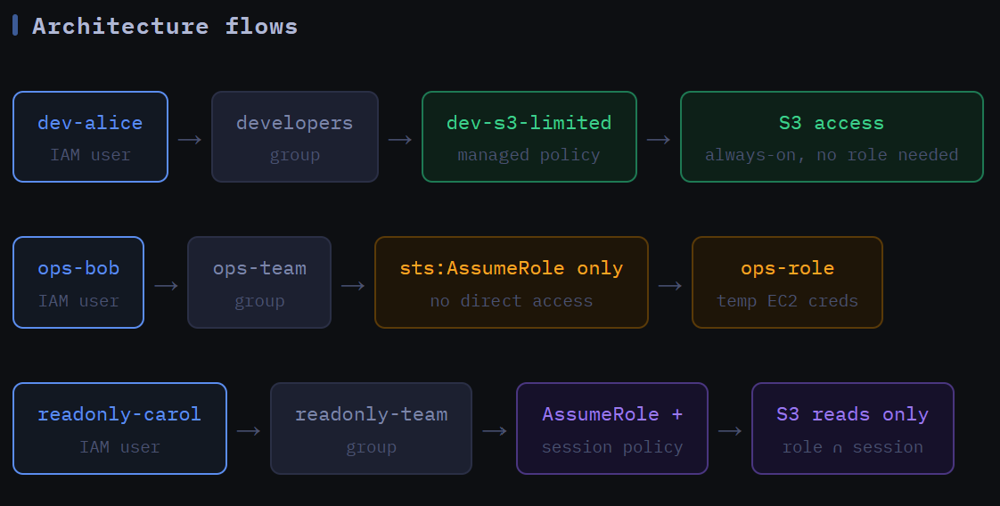
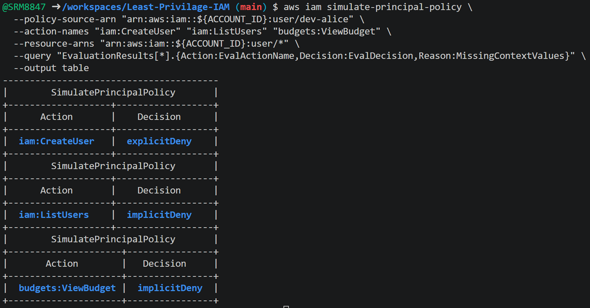

# Least Privilege IAM Lab

> **AWS Cloud Security Projects · Project 01**

Build IAM users, groups, and roles from scratch. Enforce least privilege through three distinct access patterns — direct RBAC, forced role assumption, and STS session policy narrowing. Audit everything with CloudTrail.


---

## What This Lab Demonstrates

This lab uses three users across three groups. Each group teaches one access model — deliberately separate so the contrast is explicit and easy to reason about.

| Group | User | Access pattern | Core concept |
|---|---|---|---|
| `developers` | `dev-alice` | Managed policy on group — direct standing permissions | Pure RBAC, no role assumption, permission boundary as ceiling |
| `ops-team` | `ops-bob` | Group grants `sts:AssumeRole` only | Zero standing access — must exchange for temp credentials to act |
| `readonly-team` | `readonly-carol` | `AssumeRole` + session policy injected at call-time | Role stays broad, session policy narrows per-caller at assume-time |



### Effective Permissions Formula

```
Effective = (Identity policy) ∩ (Permission boundary) ∩ (Session policy, if STS used)
```

All three layers must allow an action for it to succeed. Any single layer blocking it is enough to deny.

### Architecture Flows

```
dev-alice      → developers group  → dev-s3-limited (managed policy)  → S3 [always-on, no role needed]

ops-bob        → ops-team group    → sts:AssumeRole only               → ops-role [temp EC2 creds]

readonly-carol → readonly-team     → AssumeRole + session policy        → S3 reads only [role ∩ session]
```

---

## Repository Files

```
.
├── dev-s3-limited.json          # managed policy — S3 scoped to dev-bucket only
├── dev-boundary.json            # permission boundary for dev-alice
├── ops-ec2-policy.json          # inline on ops-role — EC2 start/stop, no terminate
├── ops-group-assume.json        # inline on ops-team — only sts:AssumeRole
├── readonly-group-assume.json   # inline on readonly-team — only sts:AssumeRole
├── trust-ops-team.json          # trust policy — ops-* users can assume ops-role
├── trust-readonly-team.json     # trust policy — readonly-* users can assume readonly-role
├── carol-session-policy.json    # session policy passed at carol's assume-time
└── trail-bucket-policy.json     # S3 bucket policy required by CloudTrail service
```

---

## Prerequisites

- AWS CLI v2 configured with admin-level credentials
- Default region: `us-east-1` — run `aws configure set region us-east-1`
- `envsubst` — install with `sudo apt install gettext` (Ubuntu) or `brew install gettext` (macOS)

```bash
# Verify identity and export ACCOUNT_ID — used in every phase
aws sts get-caller-identity
export ACCOUNT_ID=$(aws sts get-caller-identity --query Account --output text)
mkdir -p iam-lab && cd iam-lab
```

---

## Lab Phases

### Phase 1 — Create Groups

Groups are the RBAC containers. Policies and assume-role permissions attach to groups — users inherit everything through membership.

```bash
aws iam create-group --group-name developers
aws iam create-group --group-name ops-team
aws iam create-group --group-name readonly-team
```

```bash
# Verify
aws iam list-groups --query "Groups[*].GroupName" --output table
```

---

### Phase 2 — Create Roles

Roles are created before inline group policies because those policies reference role ARNs. The `developers` group uses direct managed policy access — no role is created for alice.

**ops-role** — assumed by `ops-*` users. Inline policy allows `ec2:Describe*`, `ec2:StartInstances`, `ec2:StopInstances` scoped to `us-east-1`, with an explicit `Deny` on `ec2:TerminateInstances` and `ec2:DeleteSecurityGroup`.

```bash
# Trust policy: any IAM user matching ops-* in this account
cat > trust-ops-team.json << EOF
{
  "Version": "2012-10-17",
  "Statement": [{
    "Effect": "Allow",
    "Principal": { "AWS": "arn:aws:iam::${ACCOUNT_ID}:root" },
    "Action": "sts:AssumeRole",
    "Condition": {
      "StringLike": { "aws:PrincipalArn": "arn:aws:iam::${ACCOUNT_ID}:user/ops-*" }
    }
  }]
}
EOF

aws iam create-role \
  --role-name ops-role \
  --assume-role-policy-document file://trust-ops-team.json

aws iam put-role-policy \
  --role-name ops-role \
  --policy-name ops-ec2-inline \
  --policy-document file://ops-ec2-policy.json
```

**readonly-role** — assumed by `readonly-*` users. Attaches the AWS managed `ReadOnlyAccess` policy deliberately broad. Narrowing happens at carol's session policy level — same role, different effective permissions per caller.

```bash
aws iam create-role \
  --role-name readonly-role \
  --assume-role-policy-document file://trust-readonly-team.json

aws iam attach-role-policy \
  --role-name readonly-role \
  --policy-arn arn:aws:iam::aws:policy/ReadOnlyAccess
```

---

### Phase 3 — Managed Policy on `developers` Group

Creates `dev-s3-limited` and attaches it directly to the group. Grants `s3:ListAllMyBuckets`, `s3:GetObject`, `s3:PutObject`, `s3:DeleteObject`, `s3:ListBucket` scoped to `dev-bucket-${ACCOUNT_ID}` only, with an explicit `Deny` on `budgets:*` and `ce:*`.

```bash
export DEV_S3_POLICY_ARN=$(aws iam list-policies \
  --query "Policies[?PolicyName=='dev-s3-limited'].Arn" \
  --output text)

aws iam attach-group-policy \
  --group-name developers \
  --policy-arn $DEV_S3_POLICY_ARN
```

```bash
# Verify — managed policy present, no inline policies
aws iam list-attached-group-policies --group-name developers \
  --query "AttachedPolicies[*].PolicyName"
# Expected: ["dev-s3-limited"]

aws iam list-group-policies --group-name developers --query "PolicyNames"
# Expected: [] — standing access only, no STS permissions
```

---

### Phase 4 — Inline Policies on `ops-team` and `readonly-team`

Each group gets exactly one inline policy: permission to call `sts:AssumeRole` on their specific role only. Zero direct AWS service access.

```bash
aws iam put-group-policy \
  --group-name ops-team \
  --policy-name allow-assume-ops-role \
  --policy-document file://ops-group-assume.json

aws iam put-group-policy \
  --group-name readonly-team \
  --policy-name allow-assume-readonly-role \
  --policy-document file://readonly-group-assume.json
```

---

### Phase 5 — Create Users, Assign Groups, Configure Profiles

```bash
aws iam create-user --user-name dev-alice
aws iam create-user --user-name ops-bob
aws iam create-user --user-name readonly-carol

aws iam add-user-to-group --user-name dev-alice      --group-name developers
aws iam add-user-to-group --user-name ops-bob        --group-name ops-team
aws iam add-user-to-group --user-name readonly-carol --group-name readonly-team

aws iam create-access-key --user-name dev-alice      > alice-keys.json
aws iam create-access-key --user-name ops-bob        > bob-keys.json
aws iam create-access-key --user-name readonly-carol > carol-keys.json

# Configure CLI profiles — region explicitly set on every profile
ALICE_AK=$(aws iam list-access-keys --user-name dev-alice \
  --query "AccessKeyMetadata[0].AccessKeyId" --output text)
ALICE_SK=$(python3 -c "import json; d=json.load(open('alice-keys.json')); print(d['AccessKey']['SecretAccessKey'])")

aws configure set aws_access_key_id     $ALICE_AK  --profile alice
aws configure set aws_secret_access_key $ALICE_SK  --profile alice
aws configure set region                us-east-1  --profile alice
# Repeat for bob and carol
```

```bash
# Verify
aws sts get-caller-identity --profile alice --query Arn --output text
aws sts get-caller-identity --profile bob   --query Arn --output text
aws sts get-caller-identity --profile carol --query Arn --output text
```

---

### Phase 6 — Permission Boundary on `dev-alice`

A permission boundary is a managed policy used as a **ceiling** — it defines the maximum permissions the user can ever have. The effective permission for any action is the intersection of identity policy AND boundary. It never grants permissions; it only caps them.

**Boundary allows:** `s3:*`, `ec2:Describe*`, `sts:AssumeRole`, `cloudwatch:GetMetricData`, `logs:Describe*`, `logs:Get*`

**Boundary explicitly denies:** `iam:*`, `organizations:*`, `account:*`, `budgets:*`

```bash
export BOUNDARY_ARN=$(aws iam list-policies \
  --query "Policies[?PolicyName=='dev-permission-boundary'].Arn" \
  --output text)

aws iam put-user-permissions-boundary \
  --user-name dev-alice \
  --permissions-boundary $BOUNDARY_ARN
```

Even if `AdministratorAccess` is attached to alice later, she will never be able to call any IAM action.

---

### Phase 7 — Create Test Buckets

Creates both test buckets so alice's live credential tests have real targets. Without this, policy simulation tests pass but runtime tests have nothing to hit.

```bash
aws s3 mb s3://dev-bucket-${ACCOUNT_ID} --region us-east-1
echo "iam-lab test object — dev-alice should read this" > test-object.txt
aws s3 cp test-object.txt s3://dev-bucket-${ACCOUNT_ID}/test-object.txt

aws s3 mb s3://other-bucket-${ACCOUNT_ID} --region us-east-1
echo "alice should NOT see this — wrong bucket" > secret-object.txt
aws s3 cp secret-object.txt s3://other-bucket-${ACCOUNT_ID}/secret-object.txt
```

---

### Phase 8 — Enable CloudTrail

CloudTrail records every API call as a JSON event. When bob assumes `ops-role` using session name `bob-ops-session`, that name appears in every CloudTrail event from that session — making it trivial to trace role usage back to an individual in an audit.

```bash
export TRAIL_BUCKET="cloudtrail-iam-lab-${ACCOUNT_ID}"
aws s3 mb s3://$TRAIL_BUCKET --region us-east-1

aws s3api put-bucket-policy \
  --bucket $TRAIL_BUCKET \
  --policy file://trail-bucket-policy.json

aws cloudtrail create-trail \
  --name iam-lab-trail \
  --s3-bucket-name $TRAIL_BUCKET \
  --is-multi-region-trail

aws cloudtrail start-logging --name iam-lab-trail
```

---

## Testing

### Restore Variables (new terminal session)

```bash
export ACCOUNT_ID=$(aws sts get-caller-identity --query Account --output text)
export DEV_S3_POLICY_ARN=$(aws iam list-policies \
  --query "Policies[?PolicyName=='dev-s3-limited'].Arn" --output text)
export BOUNDARY_ARN=$(aws iam list-policies \
  --query "Policies[?PolicyName=='dev-permission-boundary'].Arn" --output text)
export TRAIL_BUCKET="cloudtrail-iam-lab-${ACCOUNT_ID}"
```

---

### T1 — Policy Simulator (alice)

Verify logical correctness before touching real resources.

```bash
aws iam simulate-principal-policy \
  --policy-source-arn "arn:aws:iam::${ACCOUNT_ID}:user/dev-alice" \
  --action-names s3:GetObject s3:GetObject iam:CreateUser budgets:ViewBudget \
  --resource-arns \
    "arn:aws:s3:::dev-bucket-${ACCOUNT_ID}/test-object.txt" \
    "arn:aws:s3:::other-bucket-${ACCOUNT_ID}/secret-object.txt" \
    "*" "*" \
  --query "EvaluationResults[*].{Action:EvalActionName,Decision:EvalDecision}" \
  --output table
```



| Action | Resource | Expected | Reason |
|---|---|---|---|
| `s3:GetObject` | `dev-bucket` | ✅ allowed | Managed policy allows it; boundary permits `s3:*`; resource matches |
| `s3:GetObject` | `other-bucket` | ❌ denied | Policy `Resource` only lists `dev-bucket` ARNs |
| `iam:CreateUser` | `*` | ❌ denied | Boundary explicitly denies `iam:*` — no identity policy can override |
| `budgets:ViewBudget` | `*` | ❌ denied | Managed policy `DenyBilling` + boundary deny on `budgets:*` |

---

### T2 — alice Live Credential Test

Simulation confirmed logical correctness. Now confirm the same boundaries hold at runtime against real resources.

```bash
# SHOULD SUCCEED
aws s3 ls --profile alice
aws s3 cp s3://dev-bucket-${ACCOUNT_ID}/test-object.txt - --profile alice
echo "alice write test" | aws s3 cp - s3://dev-bucket-${ACCOUNT_ID}/alice-write.txt --profile alice

# SHOULD FAIL
aws s3 cp s3://other-bucket-${ACCOUNT_ID}/secret-object.txt - --profile alice
# Expected: AccessDenied — other-bucket not in policy Resource ARN

aws iam list-users --profile alice
# Expected: AccessDenied — boundary denies iam:*

aws budgets describe-budgets --account-id $ACCOUNT_ID --profile alice
# Expected: AccessDenied — DenyBilling + boundary deny
```

---

### T4 — ops-bob: Zero Direct Access → Assume `ops-role` → EC2

Bob has no direct access to any AWS service until he exchanges his user credentials for role credentials via STS.

```bash
# Step 1: prove zero direct access
aws ec2 describe-instances --profile bob --region us-east-1
# Expected: AccessDenied

# Step 2: exchange user creds for temp role creds
read -r AWS_ACCESS_KEY_ID AWS_SECRET_ACCESS_KEY AWS_SESSION_TOKEN <<(
  aws sts assume-role \
    --role-arn "arn:aws:iam::${ACCOUNT_ID}:role/ops-role" \
    --role-session-name bob-ops-session \
    --profile bob \
    --query "Credentials.[AccessKeyId,SecretAccessKey,SessionToken]" \
    --output text
)
export AWS_ACCESS_KEY_ID AWS_SECRET_ACCESS_KEY AWS_SESSION_TOKEN

aws sts get-caller-identity
# UserId: assumed-role/ops-role/bob-ops-session

# Step 3: EC2 now works
aws ec2 describe-instances --region us-east-1
aws ec2 describe-security-groups --region us-east-1

# Step 4: destructive actions still blocked
aws ec2 terminate-instances --instance-ids i-1234567890abcdef0 --region us-east-1
# Expected: AccessDenied — explicit Deny in ops-role inline policy

unset AWS_ACCESS_KEY_ID AWS_SECRET_ACCESS_KEY AWS_SESSION_TOKEN
```

> `i-1234567890abcdef0` is a valid EC2 instance ID format. EC2 returns `InvalidInstanceID.NotFound` — which occurs *after* IAM evaluation, confirming IAM allowed the call to reach EC2. Using a malformed ID causes EC2 to reject before IAM evaluates, producing the wrong error for the wrong reason.

---

### T5 — readonly-carol: Role + Session Policy Narrowing

`readonly-role` has full `ReadOnlyAccess`. Carol's `AssumeRole` call injects a session policy restricting her to S3 reads only. Same role, different effective permissions per caller.

```bash
read -r AWS_ACCESS_KEY_ID AWS_SECRET_ACCESS_KEY AWS_SESSION_TOKEN <<(
  aws sts assume-role \
    --role-arn "arn:aws:iam::${ACCOUNT_ID}:role/readonly-role" \
    --role-session-name carol-readonly-session \
    --policy file://carol-session-policy.json \
    --profile carol \
    --query "Credentials.[AccessKeyId,SecretAccessKey,SessionToken]" \
    --output text
)
export AWS_ACCESS_KEY_ID AWS_SECRET_ACCESS_KEY AWS_SESSION_TOKEN

aws s3 ls
# Expected: success — role and session both allow it

aws s3 cp s3://dev-bucket-${ACCOUNT_ID}/test-object.txt -
# Expected: success

aws ec2 describe-instances --region us-east-1
# Expected: AccessDenied — session policy doesn't include EC2

unset AWS_ACCESS_KEY_ID AWS_SECRET_ACCESS_KEY AWS_SESSION_TOKEN
```

---

### T6 — Permission Boundary Escalation Test

Temporarily attach `AdministratorAccess` to alice — she still cannot call `iam:*` because the boundary blocks it.

```bash
aws iam attach-group-policy \
  --group-name developers \
  --policy-arn arn:aws:iam::aws:policy/AdministratorAccess

aws iam list-users --profile alice
# Expected: AccessDenied — boundary denial overrides identity policy

aws iam detach-group-policy \
  --group-name developers \
  --policy-arn arn:aws:iam::aws:policy/AdministratorAccess
```

---

### T7 — Policy Simulator Console (UI)

Open the [IAM Policy Simulator](https://policysim.aws.amazon.com/), select `dev-alice`, and run simulations for `s3:GetObject` (on both buckets) and `iam:CreateUser`. The simulator shows the boundary intersection visually — why the identity policy alone isn't enough to determine the outcome.

---

### T8 — CloudTrail Audit

> Wait up to 15 minutes after running T4 before querying.

```bash
aws cloudtrail lookup-events \
  --lookup-attributes AttributeKey=Username,AttributeValue=bob-ops-session \
  --max-results 20 \
  --query "Events[*].{Time:EventTime,Event:EventName,Error:ErrorCode}" \
  --output table
```

The `Username` field shows `bob-ops-session` — not just `ops-role`. This is how auditors trace shared role usage back to an individual. Without meaningful session names, you can only know the role was assumed, not by whom or for what purpose.

---

## Are These Patterns Actually Used in Industry?

### Pattern 1 — Direct RBAC (alice)

Used, but primarily for human operators who need persistent access to specific resources — developers accessing services through the console daily. Most serious production environments have moved away from long-lived programmatic keys entirely and reserve this pattern for console users. It is the starting point that every team begins with, not the endpoint. The main limitation is that long-lived access keys represent a persistent attack surface: a leaked key is valid until someone manually rotates it.

### Pattern 2 — Forced Role Assumption (bob)

This is the dominant pattern in production AWS today and the baseline expectation at any serious cloud shop. Every CI/CD pipeline (GitHub Actions, Jenkins, CodeBuild), every Lambda function, every EC2 instance uses an IAM role to get temporary credentials — none of them carry long-lived access keys. The AWS SDK handles the STS exchange automatically when an instance profile or execution role is attached to the compute resource. You do not see the `assume-role` call because it happens under the hood. Temporary credentials expire on their own; there is nothing to rotate manually, nothing to leak into source control, nothing to clean up if a pipeline is compromised.

### Pattern 3 — Session Policy Narrowing (carol)

Used in more sophisticated setups where a single role is shared across many contexts and you need to narrow permissions per-context without proliferating roles. It shows up heavily in cross-account federation — where an external identity provider like Okta or Azure AD issues credentials to assume a role, and the session policy narrows what each user gets based on their group membership in the IdP. It also appears in privilege escalation prevention systems where an engineer requests elevated access for a specific incident, and the session policy enforces exactly what they asked for and nothing more, automatically expiring when the session ends.

### What the Industry Has Moved Toward

The direction AWS-native companies are heading — particularly at scale — is attribute-based access control (ABAC), which uses resource tags and principal tags rather than hardcoded ARNs in policy `Resource` fields. Instead of writing a policy that says `allow access to arn:aws:s3:::dev-bucket-123456`, you write one that says `allow access to any S3 bucket where the bucket's env tag matches the principal's env tag`. One policy covers every environment, every team, every account, and scales automatically as new resources are tagged correctly.

For machine identities, IRSA on EKS (IAM Roles for Service Accounts) and EC2 Instance Profiles are the standard — no key management at all. For human identities, AWS IAM Identity Center (formerly SSO) federated through an enterprise IdP is standard at mid-to-large companies, which combines role assumption with session policies automatically and provides centralized access management across an entire AWS Organization.

The three patterns in this lab are the building blocks that underlie all of those. ABAC still uses managed policies and roles. IRSA still uses assume-role. SSO still uses session policies. Understanding the primitives is what lets you reason about why the higher-level systems behave the way they do.

---

## Why Session Policies in Pattern 3 — Not Another Permission Boundary?

This is a common question because both tools appear to do the same thing: narrow permissions without granting new ones. They are not interchangeable.

### What a Permission Boundary Is

A permission boundary is attached to an identity at configuration time by an administrator. It sits there permanently and says: *this identity can never exceed these permissions, no matter what policies are attached to it later.* It is an administrative guardrail — set once, stays until an admin removes it.

```bash
# Attached to the identity — by an admin, ahead of time
aws iam put-user-permissions-boundary \
  --user-name dev-alice \
  --permissions-boundary $BOUNDARY_ARN
```

It answers the question: **what is the maximum this identity is ever allowed to do?**

### What a Session Policy Is

A session policy is passed at the moment of the `assume-role` call by the caller. It lives only for the duration of that one session and disappears when the session expires. The same role can be assumed simultaneously with completely different session policies by different callers.

```bash
# Passed at call-time — by the caller, each time, different every time
aws sts assume-role \
  --role-arn "arn:aws:iam::${ACCOUNT_ID}:role/readonly-role" \
  --role-session-name carol-readonly-session \
  --policy file://carol-session-policy.json
```

It answers the question: **what does this specific caller need from this role right now?**

### Why a Boundary Cannot Replace a Session Policy in Pattern 3

| | Permission Boundary | Session Policy |
|---|---|---|
| Attached to | The role itself — permanently | Each assume-role call — per-session |
| Who sets it | Admin, ahead of time | The caller, at call-time |
| Different per caller | ❌ Same boundary for everyone | ✅ Each caller passes their own |
| Different per session | ❌ Fixed until admin edits it | ✅ Expires with the session |
| Survives session expiry | ✅ Always present on the role | ❌ Gone when session ends |

Pattern 3's entire point is that `readonly-role` is shared, and different callers narrow it differently per session. If you attached a boundary to `readonly-role` that only allowed S3 reads, then every single caller of that role gets S3-only access permanently. Bob assumes it: S3 only. Carol assumes it: S3 only. A Lambda assumes it: S3 only. You have locked the role permanently into one narrow set — which defeats the purpose of having a shared broad role in the first place.

Session policies let carol get S3-only access while someone else assuming the same role simultaneously could get a different slice by passing a different session policy. The role stays broad. The narrowing is contextual, per-call, and ephemeral.

### The Mental Model

Think of it like a hotel key card system. The role is the master key that opens all doors. A permission boundary is the locksmith permanently downgrading the master key so it physically cannot open certain doors — for anyone, forever. A session policy is the front desk issuing a temporary copy of the master key programmed to open only certain floors for this guest's stay. The master key is unchanged; next guest gets a different copy programmed differently.

You would never call the locksmith to solve a per-guest access problem. You would never ask the front desk to enforce a permanent security ceiling. They solve different problems at different layers.

### When to Actually Use a Boundary on a Role

Boundaries on roles make sense when you are delegating `iam:CreateRole` to someone who is not a full admin and need to prevent them from creating a role with more permissions than they themselves have.

```bash
# Admin creates a role with a boundary — it can never exceed the boundary
# even if AdministratorAccess is attached to it later
aws iam create-role \
  --role-name developer-created-role \
  --assume-role-policy-document file://trust.json \
  --permissions-boundary $BOUNDARY_ARN
```

This is the privilege escalation prevention use case — not the per-session narrowing use case. They are different problems.

### Summary

| You want to... | Use |
|---|---|
| Cap the maximum permissions of a user/role permanently | Permission boundary |
| Prevent privilege escalation via delegated IAM | Permission boundary |
| Make a guardrail that survives even if policies change later | Permission boundary |
| Narrow permissions for one specific session or task | Session policy |
| Give different callers different slices of the same role | Session policy |
| Enforce per-context access (e.g. contractor for one incident) | Session policy |

---

## Concepts Reference

| Concept | Tested in |
|---|---|
| Least privilege | T1, T2 |
| RBAC | T1, T2 |
| Resource scoping | T1, T2 |
| STS assume role | T4, T5 |
| Session policies | T5 |
| Permission boundaries | T1, T6 |
| Audit trail | T8 |

---

## Cleanup

Run in dependency order.

```bash
# 1. Detach and delete group policies
aws iam detach-group-policy --group-name developers --policy-arn $DEV_S3_POLICY_ARN
aws iam delete-group-policy --group-name ops-team --policy-name allow-assume-ops-role
aws iam delete-group-policy --group-name readonly-team --policy-name allow-assume-readonly-role

# 2. Remove users, delete keys and users
for USER in dev-alice ops-bob readonly-carol; do
  for GROUP in developers ops-team readonly-team; do
    aws iam remove-user-from-group --user-name $USER --group-name $GROUP 2>/dev/null || true
  done
  KEY=$(aws iam list-access-keys --user-name $USER \
    --query "AccessKeyMetadata[0].AccessKeyId" --output text 2>/dev/null)
  [ "$KEY" != "None" ] && aws iam delete-access-key \
    --user-name $USER --access-key-id $KEY 2>/dev/null || true
  aws iam delete-user-permissions-boundary --user-name $USER 2>/dev/null || true
  aws iam delete-user --user-name $USER
done

# 3. Delete groups
aws iam delete-group --group-name developers
aws iam delete-group --group-name ops-team
aws iam delete-group --group-name readonly-team

# 4. Delete roles
aws iam delete-role-policy --role-name ops-role --policy-name ops-ec2-inline
aws iam delete-role --role-name ops-role
aws iam detach-role-policy --role-name readonly-role \
  --policy-arn arn:aws:iam::aws:policy/ReadOnlyAccess
aws iam delete-role --role-name readonly-role

# 5. Delete custom policies
aws iam delete-policy --policy-arn $DEV_S3_POLICY_ARN
aws iam delete-policy --policy-arn $BOUNDARY_ARN

# 6. Delete test buckets
aws s3 rb s3://dev-bucket-${ACCOUNT_ID} --force
aws s3 rb s3://other-bucket-${ACCOUNT_ID} --force

# 7. Stop trail and delete trail bucket
aws cloudtrail stop-logging --name iam-lab-trail
aws cloudtrail delete-trail --name iam-lab-trail
aws s3 rb s3://$TRAIL_BUCKET --force
```

---

## Related Resources

- [AWS IAM User Guide](https://docs.aws.amazon.com/IAM/latest/UserGuide/introduction.html)
- [IAM Policy Simulator](https://policysim.aws.amazon.com)
- [AWS Security Best Practices — Well-Architected](https://docs.aws.amazon.com/wellarchitected/latest/security-pillar/welcome.html)
- [ABAC for AWS](https://docs.aws.amazon.com/IAM/latest/UserGuide/introduction_attribute-based-access-control.html)
- [IAM Roles for Service Accounts (IRSA on EKS)](https://docs.aws.amazon.com/eks/latest/userguide/iam-roles-for-service-accounts.html)
